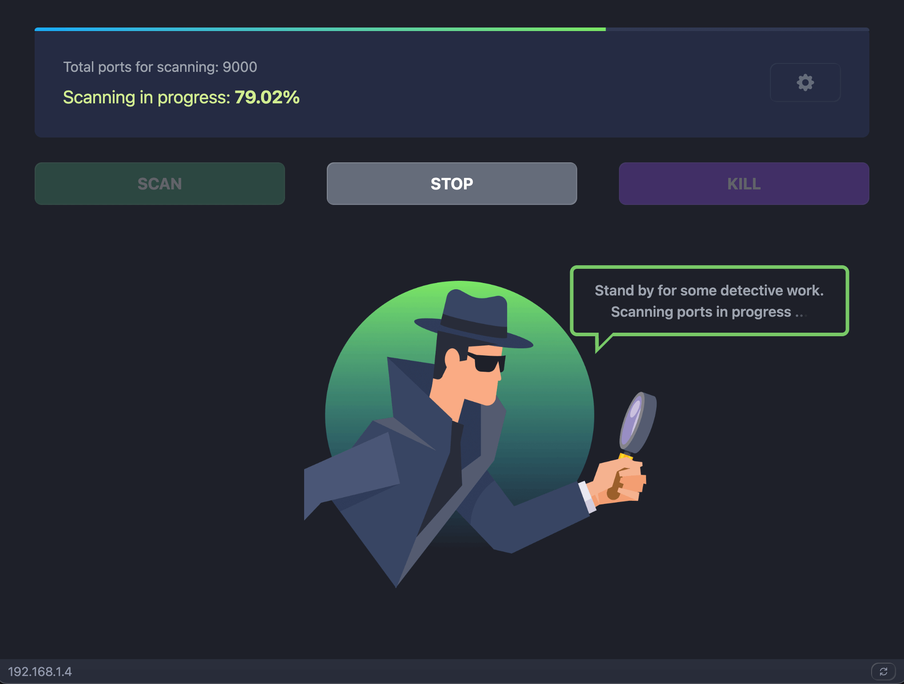

##  Localhost Port Scanner

The "Localhost Port Scanner" is a network utility tool designed to assist users in scanning a custom range of network ports, checking their status, and optionally terminating processes associated with specific ports.


Features:

-   Custom Port Range Scanning: Users can specify a custom range of ports to scan.
-   Port information: The scanned port information provides details about the status and accessibility of network ports
-   Port Killing: Users can try to terminate network connections on selected ports.
-   Localhost IP Address Retrieval: The app can retrieve and display the IPv4 address of the localhost.



## Running Locally

1. Clone project locally
2. Install dependencies

```bash
npm install
# or
yarn install
# or
pnpm install
```

3. Start Electron app

```bash
npm run start
# or
yarn start
# or
pnpm start
```

## Scripts

-   `npm run start` | `yarn start` | `pnpm start` - starts Electron app in local development environment.
-   `npm run package` | `yarn package` | `pnpm package` - packages Electron app for distribution.
-   `npm run make` | `yarn make` | `pnpm make` - creates distributable packages app.
-   `npm run publish` | `yarn publish` | `pnpm publish` - publishes Electron app.
-   `npm run lint` | `yarn lint` | `pnpm lint` - checks code for style and formatting issues.
-   `npm run tsc` | `yarn tsc` | `pnpm tsc` - compiles TypeScript code but doesn't produce output files.

## Contact

Whether you have inquiries or employment opportunities to discuss, feel free to get in touch.
